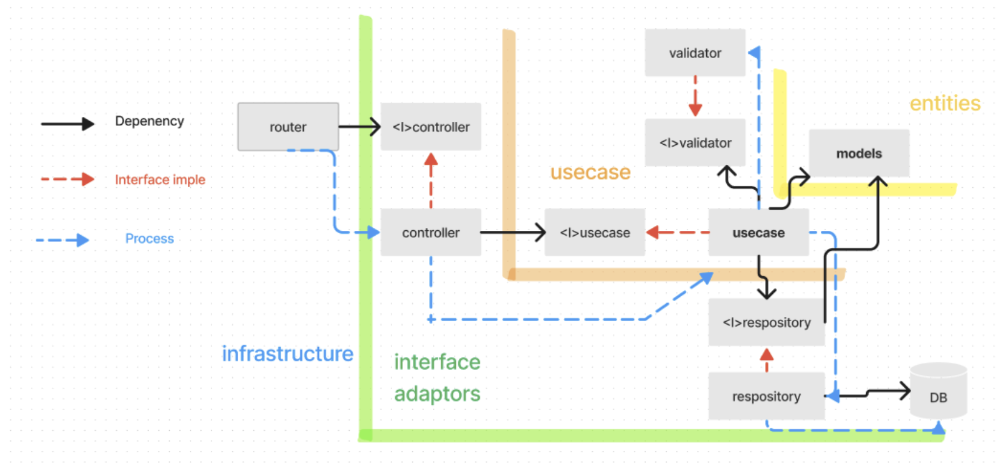

# Document of Backend🎉

## Table of contents🚩
- [Document of Backend🎉](#document-of-backend)
  - [Table of contents🚩](#table-of-contents)
    - [melit of this architecture](#melit-of-this-architecture)

<h2 id="architecture">A architecture of Backend</h2>

The Architecture of this system is `The Clean Architecture`

### melit of this architecture
- The architecture is designed to follow the Dependency Inversion Principle by placing business logic at its core. Therefore, by implementing it with arrows pointing towards the core, as seen in models, it becomes a robust architecture that can handle specification changes such as DBMS alterations.

<h2 id="lists">Lists of Backend`s skil💪</h2>

- Go v1.21.0
- Echo v4.0.0

<h2 id="api">api design document</h2>

<h2 id="db">db design document</h2>

